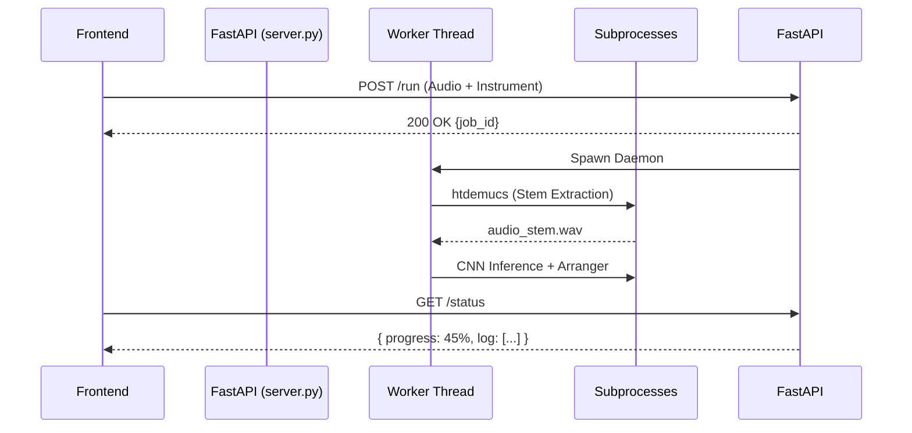

# MelodAI: Deep-System Architecture & Algorithmic Foundations
### Comprehensive Technical Whitepaper

> [!NOTE]
> This document provides an exhaustive, academic-level deep dive into the **MelodAI Audio-to-MIDI** transcription and arrangement ecosystem. It details the "how and why" behind the backend orchestration, machine learning topology, and the cognitive musicology heuristics embedded within the `expert_arranger`.

---

## 1. System Overview

At its core, MelodAI is not just a transcription utility; it is a **Generative Musicology Engine**. The pipeline is designed to solve the fundamental problem of automated music transcription: *Machine learning models extract raw frequencies, but humans play structured physical instruments.* 

Converting a raw tensor of frequencies (`[time, pitch]`) into a musically coherent Standard MIDI File (SMF) or MusicXML sheet requires intelligent constraint solving. MelodAI bridges the gap between acoustic physics and human musicality through a 4-phase pipeline:

1. **Orchestration & State Management:** Asynchronous background processing via FastAPI.
2. **Machine Learning Perception:** Stem separation, pitch tracking, and timbre classification.
3. **Cognitive Musicology Arrangement:** Algorithmic application of published music theory.
4. **Symbolic Synthesis Encoding:** Temporal modeling and acoustic humanization.

---

## 2. Backend Orchestration (`server.py`)

The backend is built on **FastAPI** coupled with the **Uvicorn** ASGI server. Due to the massive hardware constraints of running multi-gigabyte PyTorch models and librosa FFT calculations, the web server cannot block on I/O.

### 2.1 Threat Model & Threading
Loading `Demucs` and `ResNet18` simultaneously introduces massive memory pressure. If the FastAPI async loop processed these natively, the entire web server would lock up during matrix multiplication. 
* **The Solution:** We utilize standard Python `threading.Thread` and `subprocess` allocations. The `/run` endpoint immediately returns a UUID `job_id`, passing computation deep into the background.
* **Polling Architecture:** The frontend utilizes short-polling (`/status/{job_id}`) targeting a thread-safe mutex dictionary `jobs_lock`. This delivers atomic status ticks, logging strings, and percent-progress back to the UI in real-time.

---

## 3. The Machine Learning Perception Layer 

The first computational block (`prepare_for_llm.py`) acts as the system's "ears."

### 3.1 Stem Separation (Demucs)
Raw pop/rock audio causes catastrophic "ghost note" hallucinations in pitch tracking due to drum transients and bass bleeding across frequencies. 
* We spawn `htdemucs --two-stems vocals` out-of-process.
* This explicitly separates the melodic content (vocals/leads) away from the percussion, feeding the CNN a surgically sterile acoustic waveform.

### 3.2 Pitch Extraction (Basic Pitch)
Spotify's **Basic Pitch** Convolutional Neural Network (CNN) is executed over the isolated stems. It extracts raw frequencies over a 128-bin MIDI constraint window. 
* **Dynamic Thresholding:** The pipeline aggressively tunes the inference `onset_threshold` and `frame_threshold` based on the user's selected instrument. For monophonic physical instruments (Flute, Trumpet), the onset threshold is raised (`0.6`) to suppress polyphonic hallucinations, whereas Piano drops the threshold (`0.35`) to capture dense chord clusters.

### 3.3 Timbre Identification (`model.py`)
To understand *what* instrument was playing, the system uses a heavily customized **ResNet18** architecture.
* **Architecture Shift:** Standard ResNet18 models interpret 3-channel RGB images. We physically alter `backbone.conv1` by averaging the 3 learned channels into a **1-channel** tensor to digest Log-Mel Spectrograms.
* **Multi-Label Sigmoid:** We slice the fully connected layer (`fc`) off, replacing it with a sequential neural block terminating without a Softmax. We utilize `BCEWithLogitsLoss` and a Sigmoid activation because audio is intrinsically polyphonic. The model must be permitted to confidently classify *both* Piano and Violin at 90% without forcing a sum to 1.0.
* **Mixup Augmentation:** During dataset compilation, we train the model utilizing `Beta(0.4, 0.4)` distribution mixups, literally blending spectrograms together to force the model to learn polyphonic acoustic overlaps.

### 3.4 Key Detection (Krumhansl-Schmuckler)
The system calculates a `chroma_mean` (the 12 pitch classes) across the entire audio file via `librosa`. It performs a Pearson correlation coefficient map against the empirically documented **Krumhansl-Schmuckler** Major and Minor probe tone profiles to derive the global key (e.g., "C# Minor").

---

## 4. The Algorithmic Expert Arranger (`expert_arranger.py`)

> [!IMPORTANT]  
> The core algorithmic breakthrough of MelodAI. Raw CNN outputs lack human anatomy constraints and aesthetic music theory. The `expert_arranger` passes the raw data through empirical models sourced from academic cognitive musicology.

### 4.1 Frequency Band Gating
Raw models often predict notes at MIDI 15 or MIDI 120. A Flute physically cannot play those notes. The system calculates physical bounds (`INSTRUMENT_RANGES`) and permanently folds illegal frequencies via octave-shifting (`% 12`) until they reside securely within the physical instrument's range.

### 4.2 Dynamic Polyphony & Hardware Mapping
Depending on the target instrument, humans have physical limits:
* **Piano:** 2 Hands. Limit: 8-10 notes simultaneous.
* **Guitar:** 6 Strings. 1 Hand. Limit: 6 notes.
* **Flute / Trumpet:** Breath based. Monophonic. Limit: 1 note.
The arranger dynamically drops harmonic clusters exceeding the target instrument's theoretical finger limitation, enforcing the retention of the Melody (highest pitch) and Bass (lowest pitch) while pruning inner harmonies.

### 4.3 Tymoczko Voice Leading Optimizer
* **Theory:** Dmitri Tymoczko (2006) proved that humans heavily prefer minimal voice movement in chordal transitions.
* **Implementation:** The system groups notes into beat-clusters. If Chord A transitions to Chord B, it calculates the raw semitone displacement. It will dynamically invert octaves of internal harmony notes in Chord B to forcefully minimize the delta distance from Chord A.
* **Parallel Collapse Protection:** It analytically forbids parallel 5ths and octaves natively, automatically relocating offending parallel harmonies.

### 4.4 Cognitive Routing & Role Assignment
The engine implements three distinct mental models for note selection:
1. **Huron (2006):** Applies massive scoring bonuses to stepwise motion (`dist <= 2` semitones) and actively rewards "post-leap reversal" (the human tendency to resolve a massive pitch jump by stepping backward in the opposite direction).
2. **Narmour (1990):** Implements *Registral Return*. If a melody strays too far from its calculated `home_register` median, it faces mathematical penalties, forcing wild AI-hallucinated melodies to gravitate back to the center line.
3. **Pearce & Wiggins (2006):** Injects raw lookup probability tables, severely penalizing intervals that statistically do not appear in human-composed music.

### 4.5 Lerdahl Tension Budgeting
Before outputting, the system calculates a Tonal Pitch Space dissonance score. If a chord contains a Tritone, a Minor 9th, or heavily deviates from the Krumhansl-Schmuckler `global_key`, the *Density Budget* is expanded. Dissonant climax clusters are allowed +2 notes to feel "thick", while standard consonant triads are actively pruned to sound clean.

---

## 5. Temporal Encoding & Acoustic Synthesis (`to_midi.py`)

The final hurdle: perfectly quantized computer MIDI sounds robotic and synthetic.

### 5.1 Todd (1992) Phrasing Models
Neil Todd's research on human dynamics dictates how the bytes are finally written:
* **Ritardandos (Cubic Deceleration):** The final 4 notes approaching an identified phrase boundary undergo a multiplicative temporal stretch (`_rit_mult`), slowing down exactly like a human player inhaling for the next phrase.
* **Pre-Climax Nudge:** Notes rapidly approaching the highest-velocity climax of a phrase are stripped of milliseconds (`-6ms nudge`), replicating the "rushing excitation" humans experience approaching a musical climax.
* **Grid Accents:** Notes falling structurally on Beat 1 (`beat_idx % 4 == 0`) receive mathematical velocity boosts (`+8`), while off-beat syncopations are suppressed, creating human foot-tapping groove.

### 5.2 Instrument Micro-Timing
Robots hit chords atomically on zero-latency gridlines. Humans "roll" chords. The system maps rigid offsets:
* **Piano:** Uniform random jitter `[-10ms, 10ms]`.
* **Guitar:** Strum simulation. Bass strings hit `-10ms` early; treble strings hit `+15ms` late.
* **Wind/Bowed (Flute, Violin):** Bow travel and breath activation latency. Melody is universally delayed by `+25ms`.

## 6. Conclusion
The MelodAI architecture actively demonstrates that Deep Learning (CNNs + ResNets) is exceptional at *Perception* (detecting frequencies across noisy spectrograms), but terrible at *Logic* (structuring an anatomically possible Guitar chord). 
By isolating ML processing securely in worker threads and applying a strict cascade of deterministic, empirical musicology heuristics over the raw mathematical tensors, the software bridges the gap between raw AI perception and deeply human musical logic.
