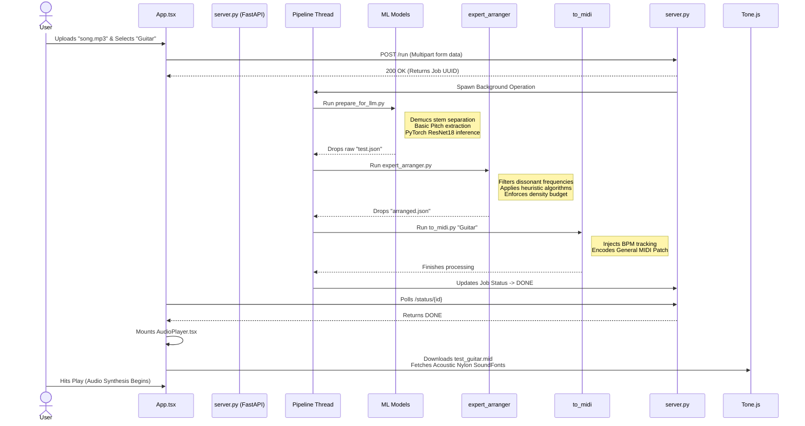

# MelodAI: Comprehensive System Architecture & Codebase Guide

This document is the master architectural blueprint of **MelodAI**, detailing every facet of the technology stack, the complete codebase module mapping, the machine learning pipeline, computational heuristics, and the React frontend integration.

---

## 🛠️ 1. Comprehensive Tech Stack

### 🖥️ Frontend Stack
- **Framework:** React 18, utilizing functional components and hooks (`useEffect`, `useCallback`, `useRef`).
- **Build Tool:** Vite (lightning-fast HMR and highly optimized Nginx static building).
- **Styling:** Framework-less Pure CSS building a bespoke **Neo-Brutalist** design system (`index.css`), leveraging raw CSS Variables, brutalist box-shadow tracking, and deterministic styling without utility libraries.
- **Audio Engine:** `Tone.js` alongside `@tonejs/midi` parser. Used to bypass standard browser limitations by spawning a high-performance Web Audio API `Transport` timeline to synchronize multiple audio sources algorithmically.
- **Language:** TypeScript strictly enforcing interface types over complex ML Job JSON definitions.

### ⚙️ Backend Core (API / Orchestration)
- **Framework:** FastAPI, acting as a lightweight, lightning-fast asynchronous Web Server handling parallel I/O blocks. Server driven by Uvicorn ASGI.
- **Concurrency:** Threading-based background queues managed locally via `server.py` rather than relying on heavy external caches like Redis. This enables robust asynchronous polling pipelines (`/status/{job_id}`).
- **Subprocesses:** Safely executes heavy GPU/CPU-bound Python scripts out-of-process via standard `subprocess` invocations, isolating ML memory leaks from the web server thread.

### 🧠 Machine Learning & Data Science Stack
- **Stem Separation:** Meta's `Demucs` (Deep learning model splitting `.mp3` into spectral stem `.wav` components).
- **Pitch Tracking:** Spotify's `Basic Pitch` (Convolutional neural network extracting polyphonic frequency maps).
- **Timbre Inference (Classification):** `PyTorch` and `Torchvision` powering an aggressively customized ResNet18 model configured to digest 1-channel Mel Spectrograms.
- **Audio Processing:** `librosa` and `torchaudio` for parsing `.wav` frequencies, extracting MFCCs, Chroma, and plotting Short-Time Fourier Transforms (STFT).
- **Symbolic Formatting:** `pretty_midi` formatting programmatic arrays into strict Standard MIDI Files.

### 🐳 Infrastructure Stack
- **Containerization:** Strict `Dockerfile` definitions. Multi-stage builds for the React frontend, and massive dependency isolation for the PyTorch backend.
- **Orchestration:** `docker-compose.yml` defining synchronized inter-container HTTP networks while physically mounting output `/uploads` and `/outputs` volumes to the host Windows machine to retain ML processing logs dynamically.
- **Web Server:** Nginx (alpine reverse-proxying built static Vite outputs).

---

## 📂 2. Codebase Directory Mapping

An exhaustive breakdown of every critical system script and its programmatic responsibility.

### Backend Application
- **`server.py`:** The master FastAPI orchestration entry point. Creates the `/run` POST endpoint, allocates tracking UUIDs, spins up daemon Python threads to execute the pipeline subprocesses sequentially, and provides the `/status/{jobId}` polling queue for the frontend UI.
- **`prepare_for_llm.py`:** The primary wrapper script executing the first block of the ML pipeline. Spawns Demucs to chunk audio, executes Basic Pitch on isolated stems, processes those via Librosa spectrograms, and pipes inferences through the trained ResNet18 checkpoint. Dumps a flattened raw `test.json`.
- **`expert_arranger.py`:** The massive computational musicology rule-engine. Takes the raw JSON and applies mathematically derived cognitive rules (voice-leading logic, structural density processing, bounds checking) to convert raw unstructured ML arrays into structured sheet music logic.
- **`to_midi.py`:** Receives the fully arranged algorithmic JSON and executes the physical byte-code mapping utilizing `pretty_midi` to burn `.mid` files while applying localized timing offsets for ritardandos and crescendos.
- **`algorithmic_transcriber.py` / `inference.py`:** Legacy entry points testing transcription heuristics isolated from the FastAPI server blocks.

### Frontend Application (`frontend/src/`)
- **`components/AudioPlayer.tsx`:** The most mathematically complex frontend UI block. Handles downloading the generated `.mid` array, natively initializing a `Tone.Sampler` against the `gleitz/midi-js-soundfonts/FluidR3_GM/` CDNs relative to the user's instrument selection (Piano vs Guitar), forcing Web Audio timeline synchronizations.
- **`hooks/useAudioSync.ts`:** A custom hook wrapping pure DOM manipulation to calculate explicit drift offsets linking the uncoupled ML-generated Tone.js Transport timeline securely to the physical native user-uploaded HTML5 `<audio>` tag time offsets.
- **`components/ResultView.tsx` & `ProcessingView.tsx`:** Distinct UI routers dynamically rendering brutalist DOM states directly driven by the backend FastAPI `/status` tracking codes.

---

## 🌊 3. End-to-End System Workflow

---

## 🧬 4. Machine Learning Pipeline Deep-Dive

### Step 1: Mitigating Polyphonic Collisions
Running standard pitch extraction over heavily mastered pop/rock tracks leads to catastrophic hallucinatory "ghost notes" caused by percussive transients or bass frequencies harmonic overlapping. MelodAI begins by utilizing **Demucs** to algorithmically extract pure `vocals` and `other` melodic content, dumping `drums` away from the tensor memory.

### Step 2: Convolutional Pitch Extraction
With a surgically clean melodic stem isolated, Spotify's **Basic Pitch** CNN analyzes the audio. It charts occurrences against a 128-bin Midi window and converts raw acoustic waveforms directly into a heavily saturated JSON tensor defining the duration and localized timing of every distinct frequency.

### Step 3: Timbre & Classifier
**PyTorch** transforms the raw audio window into a logarithmic Mel Spectrogram visual tensor. This tensor is run dynamically through the internal `best_model.pt` ResNet18 model checkpoints to determine instrument classes based heavily on analyzing timbre transients instead of pitch content.

---

## 🧮 5. Algorithmic Expert Arranger Engine Breakdown

Once ML has extracted pitch vectors, raw transcriptions lack basic human musical coherence (violating logic like octaves flying out of physical human bounds, impossibly dense 16-note chord clusters, or lack of phrasing dynamics).

The **`expert_arranger.py`** uses algorithmic implementations of specific cognitive musicology models:

- **Geometric Voice-Leading (`optimize_voice_leading`)**: Minimizes semitone displacement calculating transition values abstractly (Tymoczko, 2006). Actively checks arrays forbidding Parallel 5ths.
- **Tension Budgeting (`compute_tension`)**: Analytically mathematically weighs chords (detecting tritones, minor 9ths, leading tone dominants). Automatically drops physical note arrangements on resolving chords, enabling real-world "swell and pull" dynamics (Lerdahl, 2001).
- **Registral Return (`assign_roles`)**: Programmatically forces wild ML-generated intervals continually deviating outward away from a phrase's home-median into penalized boundaries, enforcing human predictability (Narmour, 1990).
- **Empirical Probability (`assign_roles`)**: Checks intervals against Pearce & Wiggins (2006) lookup tables, injecting enormous bias towards stepwise minor-second / major-second motion natively eliminating uncontextualized massive leaps.

This script outputs a profoundly refined, musically correct JSON symbolic graph.

---

## 🎼 6. Synthesis Encoding (`to_midi.py`)

Takes the heavily filtered and musically structured array and physically translates it back into recognizable bytes:
- Uses `pretty_midi.Instrument` object allocation to explicitly track the backend-defined selection. 
- Applies **Todd (1992)** phrasing models automatically injecting rigid micro-second temporal shifts pushing velocities harder approaching a climax string, while executing aggressive localized cubic curve ritardandos at the explicit decay marker of defined musical phrases. 
- Writes securely back to the persistent Docker Volume as `output_Instrument.mid`.
