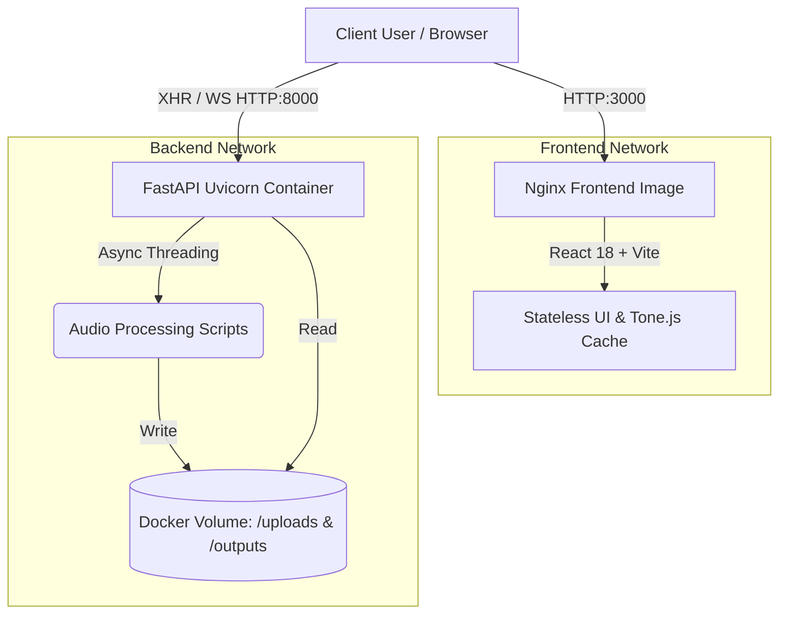

# MelodAI: Comprehensive System Architecture

This document defines the high-level infrastructure, machine-learning data pipelines, algorithmic orchestration heuristics, and frontend application systems that power **MelodAI**.

---

## 🏗️ 1. Infrastructure Architecture

The entire application runs as a multi-container Dockerized ecosystem to ensure clean separation of concerns and deterministic PyTorch executions.

### Backend (Python Core)
* **Framework:** FastAPI wrapped in Uvicorn ASGI. Serves RESTful routes (`/run`, `/status`, `/download`, `/audio`).
* **Concurrency Model:** Uses `threading` locks over memory-based Job Dictionaries to track pipeline instances (`DEMUCS -> BASIC_PITCH -> ARRANGEMENT ...`), mitigating `Celery/Redis` bloat for lightweight local operations.
* **Storage:** Utilizes persistent Docker volumes for intermediate artifacts (`.mp3`, `.wav`, `.json`, `.mid`) to preserve pipeline visibility and handle massive ML tensor drops seamlessly.

### Frontend (React Core)
* **Framework:** React 18 orchestrated by Vite.
* **Component Model:** Strictly brutalist UI components built heavily on `useState` and extensive `useEffect` polling strategies syncing up with the backend jobs.

---

## 🧠 2. Machine Learning Data Pipeline

MelodAI sequentially triggers multiple independent narrow AI models to bridge the conversion from complex polyphonic waveforms into symbolic graphs.

### Step 2.1: Surgical Stem Separation (`Demucs`)
* Takes standard stereo `.mp3`.
* Maps directly into the Meta Demucs `htdemucs` neural net.
* Isolates and outputs 4 fundamental spectral stems (`vocals.wav`, `drums.wav`, `bass.wav`, `other.wav`).
* **Purpose:** Directly suppresses immense polyphonic collisions and harmonic distortion prior to note-tracking. 

### Step 2.2: Note Event Tracking (`Basic Pitch`)
* Consumes the separated stems.
* Fed through Spotify's Basic Pitch convolution neural net.
* Detects complex frequency gradients, converting them into multi-track JSON arrays containing `[pitch, start_time, duration, volume, confidence]`.

### Step 2.3: Timbre Inference (`ResNet18`)
* Mel-Spectrogram segmentation takes small temporal slices of the original audio.
* Processed by a PyTorch ResNet18 model modified for 1-channel mel-graphs.
* Predicts probabilities against 28 trained instrument typologies natively simulating label distribution.
* Directly informs the resulting `.mid` formatting track instrument (`Program Changes`).

---

## 🎹 3. The "Expert Arranger" Orchestration Engine

Instead of relying on fragile and computationally expensive LLM sequence generators, MelodAI formats the raw chaotic tracked ML notes through a deep deterministic rules-engine strictly built atop **Computational Musicology and Cognitive Science**.

### Core Heuristics Implemented (`expert_arranger.py`)

1. **Topological Harmonics (Tymoczko, 2006)**
   - Resolves optimal voice-leading transitions mathematically by calculating minimal semitone displacements in abstract geometric space between chord transitions.
   - Includes real-time runtime detection to suppress parallel fifths or parallel octaves.

2. **Tension-Aware Density Budgeting (Lerdahl, 2001)**
   - Actively parses structural tonal groupings to flag high-tension chords (Tritones, Leading tones).
   - Dynamically expands the "note budget" allowing thick heavy arrangements on tension peaks, rapidly culling density to 1 or 2 voices during resolutions for "swell" mechanics.

3. **Stepwise Expectancy (Huron, 2006 & Pearce, 2006)**
   - Utilizes lookup-tables scaling interval jumps against empirical biological distributions (rewarding minor-seconds heavily, heavily penalizing uncontextualized major-sevenths or chaotic tritone jumps).
   - Generates predictable horizontal melodic fluidity.

4. **Directional Realization Model (Narmour, 1990)**
   - Prevents run-away register drift by scoring penalties when notes leave a rolling phrase "median boundary".
   - Demands counter-movement immediately following massive register leaps.

5. **Dynamic Phrasing Simulation (Todd, 1992)**
   - Injected into `to_midi.py`.
   - Modifies internal event timings milliseconds forward prior to peak climax sections (simulating physical musician 'leaning').
   - Applies cubic deceleration curve ritardandos at the end of localized phrase limits.

---

## 🎵 4. Browser Synthesis Stack

To allow seamless auditory preview of generated datasets, MelodAI completely bypasses rudimentary oscillator nodes.

### Tone.js High-Fidelity Injection
* Instantiates `Tone.Sampler` pointing to the massive `gleitz/midi-js-soundfonts/FluidR3_GM/` repository CDNs.
* Dynamically fetches individual standard 88-key MP3 mappings representing exact mapped instruments (Nylon acoustic guitar vs Grand Piano).
* Overlays MIDI timing directly on parallel Transport scheduling. 

### Audio Synchronization (`useAudioSync`)
* Ties the native DOM `<audio>` original-recording target timeline context synchronously with the `Tone.Transport` thread.
* Exposes complex mixer tracks to the user, allowing individual localized audio fading overlaying the native source against the algorithmic MIDI extraction.
